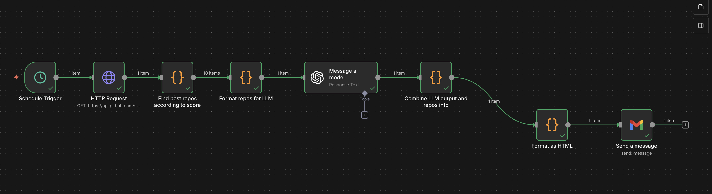

# AI GitHub Digest

Automated weekly email digest of trending AI/ML repositories on GitHub, powered by n8n.

## Workflow Overview




## Features

- Searches GitHub for trending AI/ML repositories (Python-focused)
- Intelligent scoring based on stars, forks, and activity
- AI-powered email generation using OpenAI
- Weekly automated email delivery via Gmail
- Docker-ready for easy self-hosting

## Quick Start

```bash
git clone https://github.com/FrancescoCelino/ai_github_digest.git
cd ai_github_digest
cp env.example .env
nano .env
docker-compose up -d
```

1. Access n8n UI at http://localhost:5678
2. Import workflow from `workflows/AI_github_digest.json`
3. Configure credentials (see [docs/CREDENTIALS.md](docs/CREDENTIALS.md))
4. Activate the workflow

## Requirements

- Docker and Docker Compose
- GitHub Personal Access Token
- OpenAI API Key
- Gmail account

## Documentation

- [DOCKER_SETUP.md](DOCKER_SETUP.md) - Docker deployment
- [docs/SETUP.md](docs/SETUP.md) - Manual installation
- [docs/CREDENTIALS.md](docs/CREDENTIALS.md) - API keys and authentication

## License

MIT License - see [LICENSE](LICENSE) file for details.

## Version History

### v1.0.0 (2025-11-24)

- Initial release
- GitHub API integration
- Email digest with top 10 repos
- Weekly scheduling

### v1.1.0 (planned)

- Add database storage
- Track already-seen repos
- Multiple topic categories